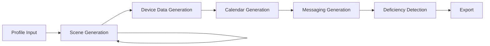

# Life Scene Dataset Generator 🧬

Synthetic dataset generation framework for creating realistic life scenes with device data, calendar events, messages, and health deficiency analysis.

## Architecture

```
dataset/
├── config/
│   ├── devices.yaml          # Device specifications and ranges
│   ├── deficiencies.yaml     # Health deficiency categories
│   └── config.yaml           # Generation settings
├── src/
│   ├── prompts/
│   │   └── prompts.yaml      # All LLM prompts (English)
│   ├── agents/
│   │   └── dataset_generation_graph.py  # Main LangGraph pipeline
│   ├── tools/
│   │   └── health_tools.py   # Health validation tools
│   └── utils/
│       └── exporter.py       # Export utilities
├── assets/
│   └── dataset_graph.png     # Graph visualization
├── output/                   # Generated datasets
├── app.py                    # Streamlit UI
└── requirements.txt
```

## Pipeline Flow



## Setup

### 1. Install Dependencies

```bash
cd dataset
pip install -r requirements.txt
```

### 2. Configure Environment

Create `.env` file:

```bash
GROQ_API_KEY=your_groq_api_key_here
```

### 3. Configure Settings

Edit `config/config.yaml`:

```yaml
generation:
  num_scenes: 5
  output_format: "json"

llm:
  model: "meta-llama/llama-4-scout-17b-16e-instruct"
  temperature: 0.7
```

## Usage

### Streamlit UI (Recommended)

```bash
streamlit run app.py
```

Navigate to `http://localhost:8501` and:
1. Enter or select a person profile
2. Configure number of scenes
3. Click "Generate Dataset"
4. View and download results

### Programmatic Usage

```python
from src.agents.dataset_generation_graph import DatasetGenerationGraph
from src.utils.exporter import export_to_json
import os

# Initialize
graph = DatasetGenerationGraph(
    llm_api_key=os.getenv("GROQ_API_KEY"),
    enable_logging=True
)

# Generate
profile = """
Marco is a 32-year-old software engineer living in Milan.
He works remotely, runs 3x/week, and struggles with sleep
consistency during deadlines.
"""

dataset = graph.run(profile=profile, num_scenes=5)

# Export
filepath = export_to_json(dataset)
print(f"Dataset saved to: {filepath}")
```

## Dataset Structure

```json
{
  "profile": "Person description...",
  "num_scenes": 5,
  "scenes": [
    {
      "scene_id": 1,
      "day": "Monday",
      "time": "morning",
      "description": "Scene description...",
      "device_data": {
        "smartwatch": {
          "heart_rate": [65, 68, 72],
          "steps": 8500,
          "calories_burned": 2200
        },
        "gps": {...},
        "smartphone": {...},
        "smartring": {...}
      },
      "calendar_events": [
        {
          "title": "Team Standup",
          "start_time": "09:00",
          "end_time": "09:30",
          "location": "Online"
        }
      ],
      "messages": [
        {
          "platform": "WhatsApp",
          "direction": "sent",
          "contact": "John",
          "timestamp": "09:45",
          "content": "Running late, be there in 10"
        }
      ],
      "deficiencies": {
        "physical_activity": {
          "status": "OK",
          "reason": "8500 steps meets minimum recommended"
        },
        "sleep": {
          "status": "INSUFFICIENT",
          "reason": "Only 5.5 hours detected, below minimum 6h"
        },
        "nutrition": {...},
        "stress": {...},
        "hydration": {...},
        "social_interaction": {...}
      }
    }
  ]
}
```

## Configuration

### Devices (`config/devices.yaml`)

Define device types and metric ranges:

```yaml
smartwatch:
  metrics:
    heart_rate:
      rest_range: [50, 80]
      intense_activity_range: [150, 190]
    steps:
      range: [0, 25000]
```

### Deficiencies (`config/deficiencies.yaml`)

Define health categories and thresholds:

```yaml
physical_activity:
  thresholds:
    steps_minimum: 5000
    steps_recommended: 10000
  evaluation:
    OK: "Meeting recommended levels"
    INSUFFICIENT: "Below minimum levels"
```

### Prompts (`src/prompts/prompts.yaml`)

All LLM prompts are centralized here. Each node uses a specific prompt template.

## Health Validation Tools

The framework includes tools for validating metrics:

- `validate_steps_count` - Check daily step goal
- `validate_heart_rate` - Context-aware HR validation
- `validate_sleep_duration` - Sleep quality check
- `validate_active_minutes` - Activity level validation
- `validate_hrv` - Stress indicator
- `validate_body_temperature` - Normal range check

## Graph Visualization

The pipeline automatically generates a visualization at `assets/dataset_graph.png`.

## Output Formats

### JSON (Default)
Complete dataset with full nested structure.

### CSV
Flattened version for spreadsheet analysis.

## Use Cases

- Testing health monitoring systems
- Training ML models for health analysis
- Simulating user behavior patterns
- Privacy-preserving dataset generation
- Prototyping digital twin applications

## Reusing Project Infrastructure

This framework reuses:
- ✅ Config management from `src/config/config_manager.py`
- ✅ LLM setup from `src/llm/`
- ✅ Prompt management pattern
- ✅ LangGraph architecture
- ✅ YAML-based configuration
- ✅ Structured output with Pydantic
- ✅ Graph visualization

## Notes

- All prompts are in English
- Data is synthetic and plausible but not real
- Deficiency detection uses rule-based tools + LLM reasoning
- Graph saves diagram to `assets/` on initialization
- Supports multiple LLM models via Groq

## License

Part of the HumanDigitalTwin project.
